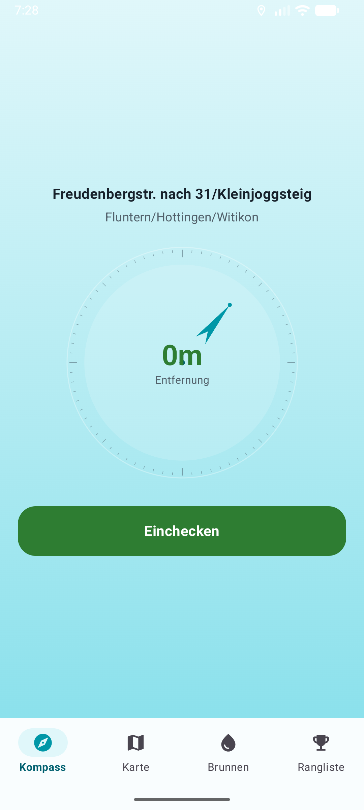
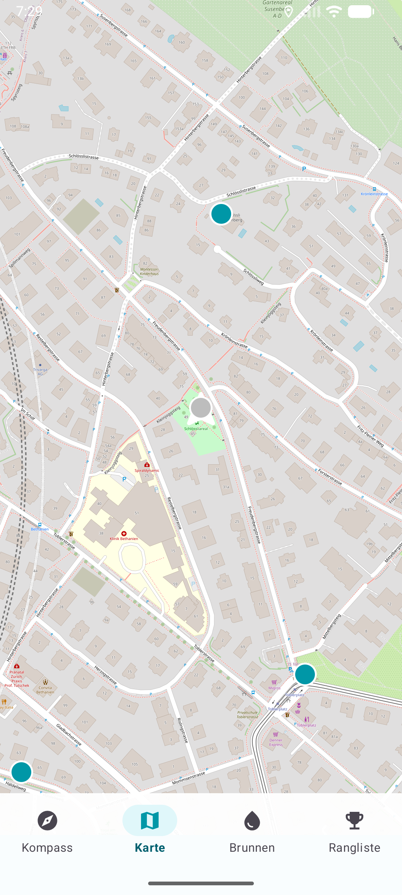
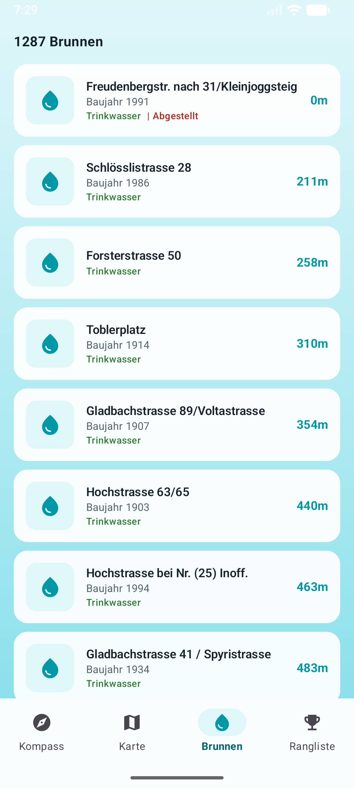
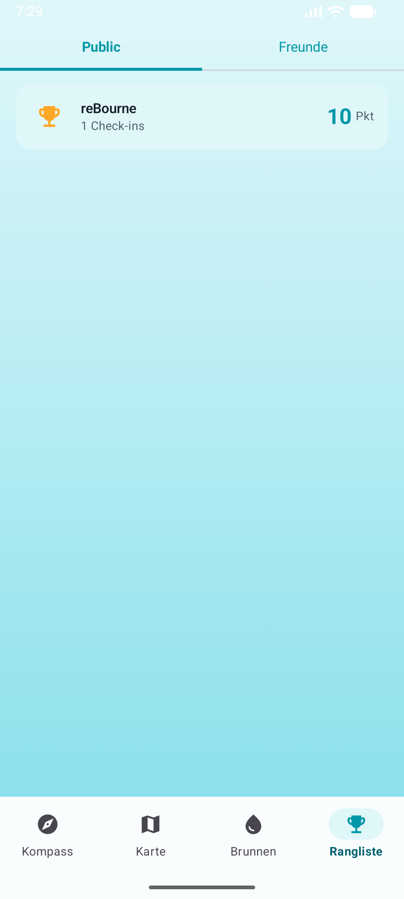

# Trinkbrunnen Zürich

Native Android App zum Entdecken, Finden und Einchecken an den 1287 Trinkbrunnen der Stadt Zürich.

## Screenshots

| Kompass | Karte | Brunnenliste | Rangliste |
|---------|-------|--------------|-----------|
|  |  |  |  |

## Features

- **Kompass** — Zeigt Richtung und Entfernung zum nächsten Brunnen. Check-in Button erscheint innerhalb von 20m mit 10-Sekunden GPS-Verifizierung.
- **Karte** — OpenStreetMap mit allen Brunnen als farbige Punkte (Trinkwasser / kein Trinkwasser / abgestellt) und eigenem Standort.
- **Brunnenliste** — Alle 1287 Brunnen sortiert nach Entfernung mit Name, Baujahr, Trinkwasser-Status und Detail-Ansicht.
- **Rangliste** — Public Leaderboard und privates Freunde-Leaderboard. Freunde per Nickname hinzufügen.
- **Gamification** — 10 Punkte pro erfolgreichem Check-in. GPS wird 10 Sekunden lang geprüft.

## Tech Stack

- Kotlin + Jetpack Compose
- Firebase Authentication (Google Sign-In via Credential Manager)
- Cloud Firestore (Users, Check-ins, Freundschaften)
- osmdroid (OpenStreetMap)
- Google Play Services Location

## Setup

1. Erstelle ein Firebase-Projekt und registriere die Android App (`com.example.brunnenapp`)
2. Lade `google-services.json` in `app/` herunter
3. Aktiviere Google als Sign-In Provider in Firebase Authentication
4. Setze `WEB_CLIENT_ID` in `gradle.properties`
5. Füge deine SHA-1 und SHA-256 Fingerprints in der Firebase Console hinzu
6. Deploy die Firestore-Regeln: `firebase deploy --only firestore:rules`

## Bauen

```bash
./gradlew assembleDebug
```

## Datenquelle

Trinkbrunnen-Daten der Stadt Zürich (GeoJSON, 1287 Brunnen) mit Standort, Baujahr, Wasserart, Koordinaten und Fotos.
